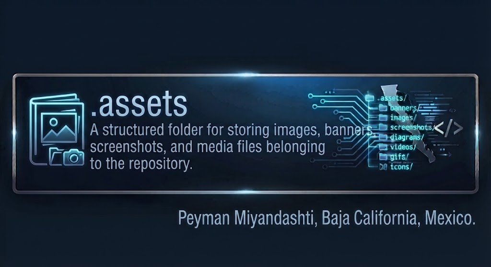

<p align="center">
  
</p>

<p align="center">
  
  
  
  
</p>

<p align="center">
  <strong>A clean visual asset library for every banner, screenshot, diagram, image, GIF, icon, and video used throughout my learning repository.</strong>
</p>

<p align="center">
  <a href="../README.md"></a>
  <a href="./banners/"></a>
  <a href="./images/"></a>
  <a href="./screenshots/"></a>
</p>

---

<h1 align="center">🗂️ .assets — Visual Asset Library</h1>

<p align="center">
  <strong>One organized place for the visual material that supports my documentation, examples, projects, and learning modules.</strong>
</p>

---

## 📘 Overview

I created the `.assets` directory to keep the visual side of this repository organized, reusable, and easy to maintain.

Instead of placing screenshots, banners, diagrams, GIFs, icons, and other media randomly inside learning folders, I keep them here and reference them from the README or documentation file that needs them.

A simple way to think about it is:

> [!NOTE]
> **The code and lessons explain what I am learning. The assets help me show it visually.**

This makes the repository easier to navigate, easier to update, and much more professional for anyone who visits it.

---

## 🧠 What I Will Learn From This Folder

By maintaining this asset library, I practice how to:

- organize visual files in a real repository;
- choose the correct asset type for a specific purpose;
- name files clearly and consistently;
- use relative paths correctly in Markdown;
- document software with screenshots and diagrams;
- keep project folders clean instead of mixing media with source code;
- create reusable visual documentation for future modules and projects.

---

## 🎯 Project Goals

The purpose of this folder is not simply to store pictures.

My goals are to create a **consistent visual documentation system** that I can reuse across the entire **Learn-How-To-Code** repository.

| Goal | Why it matters |
|---|---|
| **Organization** | Every visual file has a predictable location. |
| **Consistency** | READMEs can follow the same visual workflow and design language. |
| **Reusability** | One asset can be referenced from multiple documentation pages. |
| **Maintainability** | Images are easier to replace or update later. |
| **Professional presentation** | Visitors can understand projects faster through visual examples. |
| **Learning by demonstration** | Screenshots and diagrams make technical concepts easier to teach. |

---

## 📑 Table of Contents

- [Overview](#-overview)
- [What I Will Learn](#-what-i-will-learn-from-this-folder)
- [Project Goals](#-project-goals)
- [Asset Structure](#-asset-structure)
- [Folder Guide](#-folder-guide)
- [Quick Start](#-quick-start)
- [Naming Standard](#-naming-standard)
- [Using Assets in Markdown](#-using-assets-in-markdown)
- [Visual Documentation Workflow](#-visual-documentation-workflow)
- [Technologies & Formats](#-technologies--formats)
- [Progress](#-progress)
- [Best Practices](#-best-practices)
- [Contribution Guidelines](#-contribution-guidelines)
- [License](#-license)
- [Acknowledgments](#-acknowledgments)
- [Author & Connect](#-author--connect)

---

## 📂 Asset Structure

This is the visual organization I use for the repository:

```text
.assets/
│
├── banners/
│   ├── 01-vscode-banner.png
│   ├── 02-.assets.jpg
│   └── README.md
│
├── images/
│   ├── vscode/
│   └── README.md
│
├── screenshots/
│   ├── vscode-install/
│   ├── vscode-interface/
│   ├── vscode-release/
│   └── README.md
│
├── diagrams/
│   └── README.md
│
├── videos/
│   └── README.md
│
├── gifs/
│   └── README.md
│
├── icons/
│   └── README.md
│
└── README.md
```

> [!IMPORTANT]
> Every major asset category can have its own `README.md` so the purpose, naming rules, and usage of that folder are documented instead of being assumed.

---

## 🗃️ Folder Guide

| Folder | What I use it for | Example |
|---|---|---|
| `banners/` | Main visual headers for modules, tools, and project READMEs | VS Code module banner |
| `images/` | General illustrations and supporting visual material | Story of VS Code image |
| `screenshots/` | Real screenshots captured during installation, setup, execution, or testing | VS Code installation steps |
| `diagrams/` | Architecture, workflow, system, and concept diagrams | Project flowchart |
| `videos/` | Short demonstrations and project output recordings | Application demo |
| `gifs/` | Lightweight animated demonstrations | CLI or UI workflow |
| `icons/` | Reusable icons, logos, and small visual elements | Technology icon |

---

## 🚀 Quick Start

### 1. Decide what kind of visual I have

Before saving a file, I first ask:

```text
Is it a banner?
Is it a normal image?
Is it a screenshot?
Is it a diagram?
Is it a video?
Is it a GIF?
Is it an icon?
```

### 2. Save it in the correct folder

For example:

```text
VS Code installation screenshot
        ↓
.assets/screenshots/vscode-install/
```

### 3. Give it a descriptive filename

```text
04-select-additional-tasks.png
```

is much better than:

```text
image4.png
```

### 4. Reference it from the README

```markdown

```

> [!TIP]
> I use numbered filenames when screenshots belong to a sequence. This lets a beginner follow the tutorial in the correct order without guessing.

---

## 🏷️ Naming Standard

I use filenames that are predictable, readable, and searchable.

### Preferred pattern

```text
[number]-[topic]-[description].[extension]
```

Examples:

```text
01-vscode-banner.png
01-download-vscode.png
02-vscode-installer-exe.png
03-license-agreement.png
04-select-additional-tasks.png
python-variables-example.png
sam3-segmentation-result.png
repository-architecture.svg
```

### I avoid names like

```text
image1.png
new.png
final-final.png
screenshot123.png
untitled.jpg
test2-new-final.png
```

### My naming rules

- lowercase whenever practical;
- hyphens between words;
- clear description of the content;
- numbering when order matters;
- no unnecessary spaces;
- no meaningless names;
- no duplicate assets under slightly different filenames;
- preserve the correct file extension.

---

## 🛠️ Using Assets in Markdown

The correct relative path depends on where the README is located.

### Example: referencing the VS Code banner

From:

```text
01-INTRODUCTIONS/01-VSCODE/README.md
```

I can use:

```markdown
<p align="center">
  
</p>
```

### Example: installation screenshot

```markdown

```

### Example: centered image with controlled width

```html
<p align="center">
  
</p>
```

> [!WARNING]
> A correct filename is not enough. The **relative path must also be correct from the README that is displaying the asset**.

---

## 🔄 Visual Documentation Workflow

This is the workflow I want to follow throughout this repository:

```text
Create / capture visual
        │
        ▼
Identify asset type
        │
        ▼
Choose the correct .assets folder
        │
        ▼
Rename it clearly
        │
        ▼
Add it to GitHub
        │
        ▼
Reference it from README.md
        │
        ▼
Add explanation / caption
        │
        ▼
Verify that GitHub renders it correctly
```

For tutorials, I prefer this pattern:

```text
Explanation
   ↓
Screenshot
   ↓
What the screenshot shows
   ↓
Next action
```

That way, the README teaches instead of simply displaying images.

---

## 🧰 Technologies & Formats

| Technology / Format | How I use it |
|---|---|
| **GitHub Markdown** | Documentation and image references |
| **HTML inside Markdown** | Centering, sizing, and arranging visual elements |
| **PNG** | Screenshots, UI captures, graphics with sharp text |
| **JPG / JPEG** | Photographic or compressed banner-style images |
| **WebP** | Efficient web-friendly visual assets when appropriate |
| **SVG** | Scalable icons, diagrams, badges, and vector graphics |
| **GIF** | Short animated demonstrations |
| **MP4** | Longer demonstrations when video is genuinely useful |
| **Git** | Version control for the repository and its documentation |

---

## 📊 Progress

| Asset Area | Status | Purpose |
|---|:---:|---|
| Banners | ✅ Active | README and module headers |
| Images | ✅ Active | Supporting visuals |
| Screenshots | ✅ Active | Tutorials and real setup evidence |
| Diagrams | 🟡 Ready to expand | Architecture and workflows |
| Videos | 🟡 Ready to expand | Demonstrations |
| GIFs | 🟡 Ready to expand | Short visual walkthroughs |
| Icons | 🟡 Ready to expand | Reusable visual identity |

**Legend:** ✅ Active · 🟡 Ready to expand · 🔜 Planned

---

## 📐 Best Practices

When I add a new visual asset, I try to make sure it satisfies these rules:

- the image has a real purpose;
- the filename explains what it contains;
- it is stored in the correct category;
- screenshots appear in logical order;
- important text remains readable on GitHub;
- the README includes meaningful alt text;
- images are not unnecessarily huge;
- duplicated files are avoided;
- visual material supports the explanation instead of replacing it.

> [!NOTE]
> A professional README is not professional because it has many images. It is professional when every visual element helps the reader understand something faster.

<details>
<summary><strong>📦 File-format guidance</strong></summary>

### PNG
Best for screenshots, interfaces, diagrams with text, and images that need sharp edges.

### JPG / JPEG
Useful for photographs and some banners where smaller file size is more important than lossless detail.

### SVG
Excellent for icons, logos, diagrams, and scalable graphics.

### GIF
Useful for short demonstrations, but I avoid very large GIF files.

### MP4
Better for longer demonstrations when animation would be too large as a GIF.

</details>

---

## 🤝 Contribution Guidelines

This is primarily my personal learning repository, but I still follow contribution-style discipline.

When adding or suggesting an asset:

1. place it in the correct category;
2. use a descriptive filename;
3. avoid overwriting unrelated files;
4. keep the repository structure consistent;
5. verify that every Markdown reference renders correctly;
6. explain why the asset is useful;
7. keep visual quality high enough for documentation.

---

## 📜 License

This repository is licensed under the **MIT License**.

See the repository-level [LICENSE](../LICENSE) file for the complete license text.

---

## 🙏 Acknowledgments

I use this visual library as part of my personal programming and software-development learning journey.

The organization is inspired by common software-documentation practices: separating source material from documentation assets, using descriptive paths, and keeping visual references reusable across a repository.

---

<p align="center">
  <a href="../README.md"></a>
  <a href="./banners/"></a>
  <a href="#top"></a>
</p>

---

## 👤 Author & Connect

**Peyman Miyandashti**  
Information Technology Engineering & Digital Innovation  
Polytechnic University of Baja California  
Mexico (Iran) · 2026

<p>
  <a href="https://github.com/Peyman-mxli">
    
  </a>
  <a href="https://www.linkedin.com/in/peyman-mxli">
    
  </a>
</p>

<p align="center">
  <strong>Learn • Build • Document • Improve</strong>
</p>
