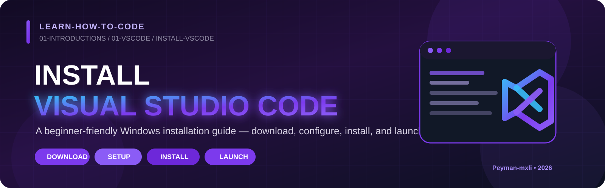

<p align="center">
  
</p>

<h1 align="center">Install Visual Studio Code on Windows</h1>

<p align="center">
  A complete beginner-friendly installation guide for Windows.
</p>

---

## 1. Open the Official Visual Studio Code Website

Open the official Visual Studio Code website:

**https://code.visualstudio.com/**

On Windows, the page normally detects the operating system automatically and displays a large **Download for Windows** button.

Click:

**Download for Windows**

The VS Code installer will begin downloading.

> [!IMPORTANT]
> Always download Visual Studio Code from the official `code.visualstudio.com` website.

---

## 2. Open the Downloaded Installer

After the download finishes, open the browser's download list or the Windows **Downloads** folder.

The file name will look similar to:

```text
VSCodeUserSetup-x64-1.136.0.exe
```

The exact version number can be different because Visual Studio Code receives regular updates.

The important parts are:

- **VSCode** — Visual Studio Code.
- **UserSetup** — the user installer.
- **x64** — the 64-bit Windows version.
- **.exe** — a Windows executable installer.

Double-click the downloaded `.exe` file to start the installation.

If Windows displays a security confirmation, verify that the installer is Visual Studio Code from Microsoft and allow it to continue.

---

## 3. Accept the License Agreement

The **Visual Studio Code Setup** window opens.

Select:

**I accept the agreement**

Then click:

**Next**

The installer cannot continue unless the license agreement is accepted.

---

## 4. Keep the Standard Installation Location

The installer may ask where Visual Studio Code should be installed.

For a normal installation, keep the default location.

Click:

**Next**

There is normally no reason for a beginner to change this path.

---

## 5. Keep the Default Start Menu Folder

The installer may also ask where the Visual Studio Code shortcut should be placed in the Windows Start Menu.

Keep the default setting and click:

**Next**

---

## 6. Select the Additional Tasks

The **Select Additional Tasks** screen is important because it controls several useful Windows integrations.

I recommend enabling the following options:

| Option | What it does | Recommended |
|---|---|:---:|
| **Create a desktop icon** | Creates a VS Code shortcut on the desktop. | ✅ |
| **Add "Open with Code" action to Windows Explorer file context menu** | Lets you right-click a file and open it directly in VS Code. | ✅ |
| **Add "Open with Code" action to Windows Explorer directory context menu** | Lets you right-click a folder and open the entire folder in VS Code. | ✅ |
| **Register Code as an editor for supported file types** | Allows Windows to recognize VS Code as an editor for supported files. | ✅ |
| **Add to PATH (requires shell restart)** | Allows Windows terminals to recognize the `code` command. | ✅ |

### Add to PATH

Make sure this option is selected:

**Add to PATH (requires shell restart)**

This is especially useful because Windows can later recognize commands such as:

```powershell
code .
```

You do not need to run this command during installation.

If a terminal was already open before VS Code was installed, close and reopen that terminal after the installation so it can detect the updated PATH.

After selecting the options, click:

**Next**

---

## 7. Review the Ready to Install Screen

The installer now displays **Ready to Install**.

Review the selected installation settings.

If everything looks correct, click:

**Install**

If you need to change an earlier option, click **Back** instead.

---

## 8. Wait for Visual Studio Code to Install

The installer begins extracting and copying the Visual Studio Code files.

A progress bar appears while the installation is running.

Wait until the process finishes.

Do not close the installer while the installation is in progress.

---

## 9. Finish the Installation

When installation is complete, the **Completing the Visual Studio Code Setup Wizard** screen appears.

Keep this option selected:

**Launch Visual Studio Code**

Then click:

**Finish**

The installer closes and Visual Studio Code opens automatically.

If you do not want VS Code to open immediately, you can clear the **Launch Visual Studio Code** checkbox before clicking **Finish**. The program will still be installed.

---

## 10. Confirm Visual Studio Code Opens

After clicking **Finish**, Visual Studio Code should open.

You may see:

- a **Welcome** page;
- a **Release Notes** page;
- or the normal VS Code editor interface.

Any of these confirms that Visual Studio Code installed and launched successfully.

---

## Installation Complete

The complete installation process is:

```text
Open code.visualstudio.com
        ↓
Download for Windows
        ↓
Open VSCodeUserSetup .exe
        ↓
Accept the license agreement
        ↓
Keep the standard installation location
        ↓
Keep the default Start Menu folder
        ↓
Select the additional tasks
        ↓
Enable Add to PATH
        ↓
Click Install
        ↓
Wait for installation
        ↓
Keep Launch Visual Studio Code selected
        ↓
Click Finish
        ↓
Confirm VS Code opens
```

> [!IMPORTANT]
> If Visual Studio Code opens successfully after clicking **Finish**, the installation is complete.

---

<p align="center">
  <a href="../README.md">
    
  </a>
</p>

---

## Author

**Peyman Miyandashti**

[](https://github.com/Peyman-mxli)
[](https://www.linkedin.com/in/peyman-mxli)
