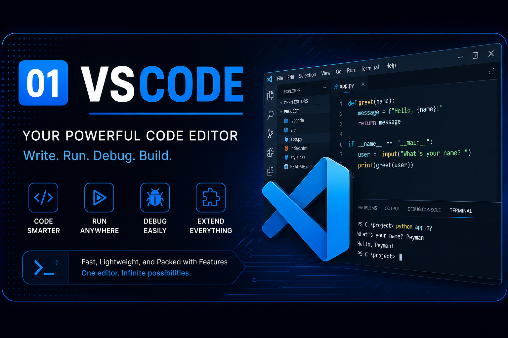
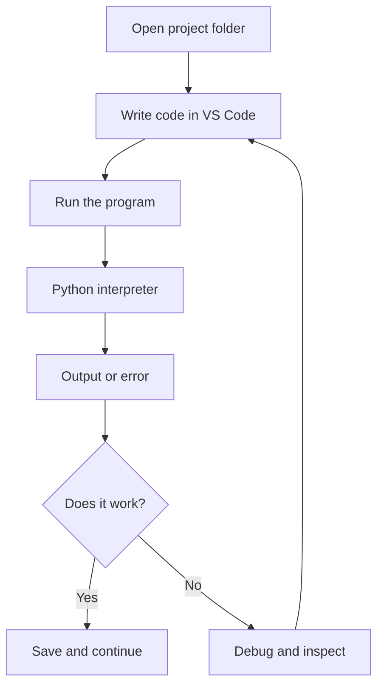

<p align="center">
  
</p>

<p align="center">
  
  
  
</p>

<p align="center"><strong>Learn how to install, configure, understand, and use Visual Studio Code as a real development workspace.</strong></p>

<h1 align="center">🟣 Visual Studio Code — Complete Beginner Guide</h1>

<p align="center">
  <a href="#-overview">Overview</a> •
  <a href="#-what-i-will-learn">What I Will Learn</a> •
  <a href="#-module-structure">Structure</a> •
  <a href="#-quick-start">Quick Start</a> •
  <a href="#-learning-roadmap">Roadmap</a>
</p>

---

## 📘 Overview

Visual Studio Code, usually called **VS Code**, is a free source-code editor developed by Microsoft. I use it as one organized workspace where I can write code, manage project files, use a terminal, install development tools, debug problems, work with Git, and run programs.

I chose to learn VS Code because it is easy enough for a beginner to start with, but powerful enough to keep using as my projects become more advanced. I can begin with a simple Python file and later use the same editor for larger software projects, web development, data science, automation, APIs, and version-control workflows.

The easiest way I understand it is:

> **VS Code is my development workspace. It helps me work with code, but it is not the programming language itself.**

### What is the difference between VS Code, Python, the terminal, an interpreter, and a compiler?

These terms can sound similar at first, so I separate them by the job each one performs.

| Concept | Easy explanation | What it does |
|---|---|---|
| **VS Code** | My coding workspace | Lets me create, edit, organize, run, and debug code |
| **Python** | A programming language | Gives me syntax and rules for writing instructions |
| **Terminal** | A text-based way to control programs and the system | Lets me type commands such as `python main.py` |
| **Python interpreter** | The program that understands Python | Reads and executes my Python code |
| **Compiler** | A program that translates source code | Converts code into another form before execution |
| **Extension** | An add-on for VS Code | Adds features such as Python support, formatting, Git tools, and notebooks |

A simple workflow makes the relationship easier to understand:

```text
I write Python code
        ↓
VS Code helps me edit and organize it
        ↓
I press Run or use the terminal
        ↓
The Python interpreter reads my code
        ↓
The computer executes the instructions
        ↓
I see the result
```

So, **VS Code is the place where I work**, **Python is the language I write**, **the terminal lets me issue commands**, and **the interpreter actually executes Python code**.

> [!IMPORTANT]
> VS Code is **not** Python. Installing VS Code does not automatically install Python. They are separate tools that work together.

---

## 🎯 Module Goals

My goal is not only to install VS Code. I want to understand **how and why developers use it** so I can build professional habits from the beginning.

By the end of this module, I want to be able to:

- understand the role of VS Code;
- install and open it correctly;
- recognize its main interface areas;
- open complete project folders;
- use the integrated terminal;
- install and manage extensions;
- connect VS Code to Python;
- select the correct interpreter;
- run Python files;
- understand debugging basics;
- use practical settings and shortcuts;
- prepare for Git and GitHub workflows.

---

## 🧠 What I Will Learn

### 1. What VS Code really is

I learn the difference between a **code editor**, a **programming language**, and the tools that execute code.

### 2. How to install VS Code

I learn where to get VS Code, which installation choices matter, and how to verify that it is ready.

### 3. How the interface works

I learn what the Explorer, Editor, Terminal, Extensions panel, Status Bar, Command Palette, Source Control, and Run and Debug areas do.

### 4. How to prepare VS Code for Python

I install Python support, select the interpreter, create a Python file, and verify that my environment works.

### 5. How to run code

I learn the difference between using the **Run button** and running a program from the **terminal**.

### 6. How extensions improve VS Code

I learn how extensions add features such as language support, formatting, linting, notebooks, Git tools, and AI assistance.

### 7. How to build professional habits

I begin using organized folders, terminal commands, formatting, debugging, version control, and repeatable workflows.

---

## 💡 Why VS Code Matters

A simple text editor can write code, but real projects need more than a place to type.

As projects grow, I need to know:

- where my project files are;
- which Python version I am using;
- how to run the program;
- where an error happened;
- how to search through the project;
- how to format code consistently;
- how to use Git;
- how to install development tools.

VS Code brings these tasks into one workspace. Good tools do not replace programming knowledge, but they help me **organize my work, understand problems, test ideas, and develop consistently**.

> [!NOTE]
> My goal is not to memorize every feature. I focus on the tools I actually need and add more as my skills grow.

---

## 🛠️ Technologies & Tools

| Technology | Role | Why I use it |
|---|---|---|
| **Visual Studio Code** | Main editor | Organizes my development workflow |
| **Python** | Programming language | Lets me practice coding |
| **Python Interpreter** | Runtime | Executes my Python programs |
| **Terminal / PowerShell** | Command-line interface | Runs commands and programs |
| **VS Code Extensions** | Editor customization | Add language and workflow features |
| **Git** | Version control | Tracks project changes |
| **GitHub** | Remote repository platform | Stores and shares my work |

---

## 📂 Module Structure

```text
01-INTRODUCTIONS/
└── 01-VSCODE/
    ├── README.md
    ├── INSTALL-VSCODE
    ├── RUNNING-PYTHON-IN-VSC
    └── VSC-EXTENSIONS
```

| File | Purpose |
|---|---|
| **README.md** | Main learning guide and module navigation |
| **INSTALL-VSCODE** | Installation and Python setup |
| **RUNNING-PYTHON-IN-VSC** | Running Python and solving common problems |
| **VSC-EXTENSIONS** | Recommended extensions and their purposes |

---

## 🚀 Quick Start

### Step 1 — Verify Python

```bash
python --version
```

On some systems:

```bash
python3 --version
```

### Step 2 — Install VS Code

➡️ [Open the complete installation guide](./INSTALL-VSCODE)

### Step 3 — Install the Python extension

Open **Extensions**, search for **Python**, and install the extension published by Microsoft.

### Step 4 — Open a project folder

```text
my-first-python-project/
└── main.py
```

Opening the whole folder gives VS Code the context of the complete project.

### Step 5 — Write a program

```python
print("Hello from Visual Studio Code!")
```

### Step 6 — Select the interpreter

Open:

```text
Ctrl + Shift + P
```

Search for:

```text
Python: Select Interpreter
```

### Step 7 — Run it

```bash
python main.py
```

Expected result:

```text
Hello from Visual Studio Code!
```

➡️ [Read the complete running-Python guide](./RUNNING-PYTHON-IN-VSC)

---

## 🖥️ Understanding the VS Code Interface

| Area | Simple explanation |
|---|---|
| **Activity Bar** | Main navigation |
| **Explorer** | Shows project folders and files |
| **Editor** | Where I write code |
| **Search** | Searches across the project |
| **Source Control** | Git tools |
| **Run and Debug** | Runs and debugs programs |
| **Extensions** | Installs and manages add-ons |
| **Integrated Terminal** | Lets me type commands inside VS Code |
| **Status Bar** | Shows interpreter, Git branch, line, encoding, and more |
| **Command Palette** | Searchable control center for VS Code commands |

### Why is the Command Palette useful?

Instead of memorizing where every command lives, I can press:

```text
Ctrl + Shift + P
```

and search for commands such as:

```text
Python: Select Interpreter
Format Document
Git: Clone
Preferences: Open Settings
```

---

## 📁 Why Open a Project Folder Instead of Only One File?

Opening the complete project folder helps VS Code understand related source files, configuration, virtual environments, Git repositories, imports, search results, debugging settings, and workspace settings.

Instead of only:

```text
main.py
```

I can work with:

```text
calculator-project/
├── main.py
├── calculator.py
├── tests/
│   └── test_calculator.py
└── README.md
```

> [!TIP]
> I create one folder for each project and open it through **File → Open Folder**.

---

## ⌨️ Integrated Terminal

The terminal lets me communicate with the operating system by typing commands.

```bash
python --version
python main.py
git status
```

The editor and terminal are different tools even though VS Code shows them in one window.

| Editor | Terminal |
|---|---|
| I write source code | I type commands |
| Works with files | Works with programs and the operating system |
| Helps me edit | Helps me execute |

---

## 🐍 Using Python in VS Code

VS Code must know **which Python interpreter should run my code**.

A computer can contain multiple environments:

```text
Python 3.11
Python 3.12
.venv
Conda environment
```

Selecting an interpreter tells VS Code which Python version and installed packages belong to the project.

> [!WARNING]
> If Python works somewhere else but VS Code reports missing packages, I first check whether VS Code selected the interpreter I expected.

➡️ [Install and configure VS Code](./INSTALL-VSCODE)

➡️ [Run Python inside VS Code](./RUNNING-PYTHON-IN-VSC)

---

## 🧩 Essential Extensions

| Extension | Purpose |
|---|---|
| **Python** | Core Python support |
| **Pylance** | IntelliSense, type information, and code analysis |
| **Black Formatter** | Automatic Python formatting |
| **Ruff** | Fast linting and code-quality checks |
| **Jupyter** | Notebook support |
| **GitLens** | Enhanced Git history |
| **GitHub Copilot** | AI-assisted coding |
| **autoDocstring** | Helps generate Python docstrings |

> [!TIP]
> I prefer to understand each extension I install instead of adding many tools without knowing what they do.

➡️ [Explore the VS Code extensions guide](./VSC-EXTENSIONS)

---

## 🐞 Debugging Introduction

Debugging lets me inspect a program while it is running.

| Concept | Meaning |
|---|---|
| **Breakpoint** | Pause execution at a chosen line |
| **Continue** | Resume until the next breakpoint |
| **Step Over** | Run the current line |
| **Step Into** | Enter a called function |
| **Step Out** | Finish the current function |
| **Variables** | Inspect stored values |
| **Debug Console** | Evaluate expressions while debugging |

```text
Write code
   ↓
Set breakpoint
   ↓
Run debugger
   ↓
Inspect values
   ↓
Find the problem
   ↓
Fix and test again
```

---

## ⚙️ Useful VS Code Settings

Useful settings include:

- **Auto Save** — automatically saves changes.
- **Format on Save** — formats code whenever I save.
- **Word Wrap** — wraps long lines.
- **Font Size** — improves readability.
- **Default Formatter** — chooses the formatter for a language.
- **Python Interpreter** — controls the Python environment.

> [!NOTE]
> A professional setup is not about enabling everything. It is about choosing settings that support a clean and reliable workflow.

---

## ⌨️ Essential Keyboard Shortcuts

| Shortcut | Action |
|---|---|
| `Ctrl + Shift + P` | Command Palette |
| `Ctrl + P` | Quick Open |
| `Ctrl + Shift + E` | Explorer |
| `Ctrl + Shift + X` | Extensions |
| `Ctrl + Backtick` | Terminal |
| `Ctrl + S` | Save |
| `Ctrl + F` | Find |
| `Ctrl + Shift + F` | Search project |
| `F5` | Start debugging |
| `Ctrl + /` | Toggle comment |
| `Shift + Alt + F` | Format document |

---

## 🧪 First Mini Exercise

Create:

```text
hello_vscode.py
```

Add:

```python
name = "Peyman"

print(f"Hello, {name}!")
print("VS Code and Python are working together.")
```

Run:

```bash
python hello_vscode.py
```

Expected output:

```text
Hello, Peyman!
VS Code and Python are working together.
```

If this works, VS Code, the Python file, the interpreter, and the terminal are working together correctly.

---

## 🧭 Development Workflow



The habit I want to develop is:

**write → run → observe → debug → improve**

---

## ⚠️ Common Beginner Problems

### Python is installed, but VS Code cannot find it

> [!WARNING]
> Installing Python and selecting a Python interpreter are separate steps.

Use:

```text
Python: Select Interpreter
```

### `python` is not recognized

Check:

```bash
python --version
```

or:

```bash
python3 --version
```

### VS Code shows an import error

The selected interpreter may be different from the environment where the package was installed.

> [!TIP]
> I verify the selected interpreter before reinstalling everything.

### Too many extensions

Extensions can overlap. I keep essential tools, disable what I do not need, and add new extensions only when they solve a real problem.

---

## 🗺️ Learning Roadmap

| Stage | Focus | Goal |
|---:|---|---|
| **01** | Understand VS Code | Know what the editor is and is not |
| **02** | Install VS Code | Build a working setup |
| **03** | Explore the interface | Recognize important tools |
| **04** | Install extensions | Add Python support |
| **05** | Configure Python | Select the correct interpreter |
| **06** | Create a project | Work from an organized folder |
| **07** | Run Python | Use Run and terminal workflows |
| **08** | Use the terminal | Become comfortable with commands |
| **09** | Debug code | Inspect programs instead of guessing |
| **10** | Add Git workflow | Prepare for version control |

---

## 📊 Module Progress

| Topic | Status |
|---|:---:|
| VS Code Introduction | ✅ Complete |
| Installation Guide | ✅ Complete |
| Python Setup | ✅ Complete |
| Running Python | ✅ Complete |
| Extensions Guide | ✅ Complete |
| Interface Fundamentals | ✅ Complete |
| Terminal Fundamentals | ✅ Complete |
| Debugging | 🟡 Learning |
| Git Integration | 🟡 Learning |
| Advanced Workspaces | 🔜 Future |

---

## 🧠 Skills Demonstrated

This module helps me practice:

- development-environment setup;
- code-editor navigation;
- project organization;
- Python interpreter configuration;
- command-line usage;
- extension management;
- debugging fundamentals;
- troubleshooting;
- Git-ready development practices;
- technical documentation.

---

## 📚 Module Guides

<p align="center">
  <a href="./INSTALL-VSCODE"></a>
  <a href="./RUNNING-PYTHON-IN-VSC"></a>
  <a href="./VSC-EXTENSIONS"></a>
</p>

---

<details>
<summary><strong>🔎 Beginner Reference — How Everything Works Together</strong></summary>

<br>

```text
Developer
   │
   ▼
VS Code
   ├── Editor
   ├── Extensions
   ├── Terminal
   ├── Debugger
   └── Git tools
          │
          ▼
   Python Interpreter
          │
          ▼
      Program Output
```

**VS Code** is the workspace.  
**Python** is the language.  
**The interpreter** executes Python.  
**The terminal** runs commands.  
**Extensions** add development features.  
**Git** tracks changes.  
**GitHub** stores and shares the repository remotely.

</details>

---

## 🤝 Contributing

This repository documents my personal coding journey, but constructive improvements are welcome. Contributions should keep explanations clear, beginner-friendly, accurate, and focused on explaining **why** something works as well as **what** to type.

---

## 📜 License

This project uses the license included in the repository.

➡️ [View the repository license](../../LICENSE)

---

## 🙏 Acknowledgments

Thanks to **Microsoft**, the **Python community**, **GitHub**, and the wider open-source community for the tools, documentation, extensions, and educational resources that support this learning journey.

---

<p align="center">
  <a href="../README.md"></a>
  <a href="../../README.md"></a>
  <a href="../02-PYTHON/"></a>
</p>

---

## 👤 Author & Connect

<p align="center">
  <strong>Peyman Miyandashti</strong><br>
  Information Technology Engineering & Digital Innovation<br>
  Polytechnic University of Baja California
</p>

<p align="center">
  <a href="https://github.com/Peyman-mxli"></a>
  <a href="https://www.linkedin.com/in/peyman-mxli/"></a>
</p>

<p align="center">
  
</p>
