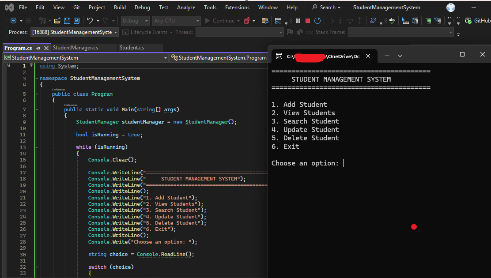

# Project 01 — Student Management System

A complete C# console application for managing student records in memory.

## Features

- add students;
- enforce unique student IDs;
- view all students;
- search by ID;
- search by full or partial name;
- update student information;
- delete with confirmation;
- validate age, email, grade, required text, and numeric input;
- report the total number of students.

## Technology

- C#
- .NET 8
- LINQ
- `List<T>`
- console application
- object-oriented programming

## Structure

```text
01-STUDENT-MANAGEMENT-SYSTEM/
├── StudentManagementSystem.csproj
├── Program.cs
├── Student.cs
├── StudentManager.cs
├── README.md
├── NOTES.md
└── REQUIREMENTS.md
```

## Build and run

Requirements:

- .NET 8 SDK or newer

Commands:

```bash
dotnet restore
dotnet build
dotnet run
```

## Data scope

Version 1 stores student records in memory. Data is intentionally lost when the application exits.

Persistence with JSON, SQLite, SQL Server, or Entity Framework Core is a future extension and is not required for this MVP.

## Completion status

- [x] Buildable .NET project file
- [x] Student domain model
- [x] Manager/business logic
- [x] Add student
- [x] View students
- [x] Search by ID
- [x] Search by name
- [x] Update student
- [x] Delete student
- [x] Unique ID validation
- [x] Age validation
- [x] Email validation
- [x] Grade validation
- [x] Safe numeric input
- [x] Clean project documentation

**Status: Complete**

## Author

**Peyman Miyandashti**  
Information Technology Engineering & Digital Innovation  
Polytechnic University of Baja California  
Mexico · 2026


## Automated tests

The project includes an xUnit test project covering duplicate-ID rejection, case-insensitive name search, and deletion behavior.

Run:

```bash
dotnet test StudentManagementSystem.Tests/StudentManagementSystem.Tests.csproj
```


